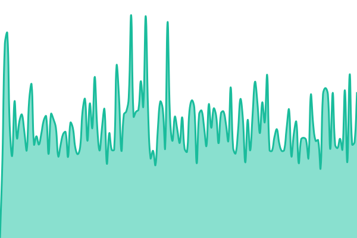
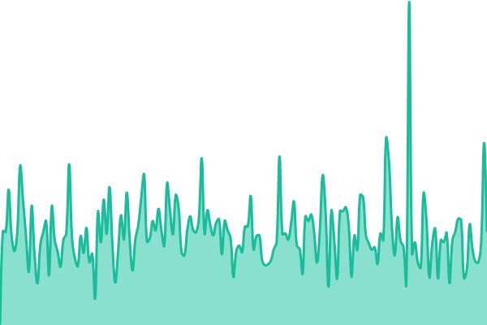
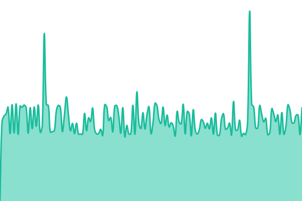

# Pteridobase status

Uptime monitoring and the public status page for
**[pteridobase.org](https://pteridobase.org)** — the
[Exotic Fern Group](https://www.exoticferngroup.org)'s fern taxonomy and
conservation data platform.

Status page: **[status.pteridobase.org](https://status.pteridobase.org)**

Built on [Upptime](https://github.com/upptime/upptime) (MIT). No server and no
subscription: the checks run on GitHub Actions, the page is GitHub Pages, and
every incident is an issue in this repository.

<!--live status--> **🟩 All systems operational**

<!--start: status pages-->
<!-- This summary is generated by Upptime (https://github.com/upptime/upptime) -->
<!-- Do not edit this manually, your changes will be overwritten -->
<!-- prettier-ignore -->
| URL | Status | History | Response Time | Uptime |
| --- | ------ | ------- | ------------- | ------ |
|  [Pteridobase](https://pteridobase.org/) | 🟩 Up | [pteridobase.yml](https://github.com/Knavesdied/pteridobase-status/commits/HEAD/history/pteridobase.yml) | 

 1240ms
     
 | 

<a href="https://status.pteridobase.org/history/pteridobase">100.00%</a>
    

|  [Exotic Fern Group](https://www.exoticferngroup.org/) | 🟩 Up | [exotic-fern-group.yml](https://github.com/Knavesdied/pteridobase-status/commits/HEAD/history/exotic-fern-group.yml) | 

 401ms
     
 | 

<a href="https://status.pteridobase.org/history/exotic-fern-group">100.00%</a>
    

|  [Pteridobase API](https://pteridobase.org/api/v1/health) | 🟩 Up | [pteridobase-api.yml](https://github.com/Knavesdied/pteridobase-status/commits/HEAD/history/pteridobase-api.yml) | 

 950ms
     
 | 

<a href="https://status.pteridobase.org/history/pteridobase-api">100.00%</a>
    

<!--end: status pages-->

## Why this exists

On 1 September 2026 production served pages in 4–47 seconds for roughly five
hours. **Nothing alerted — the owner noticed.** Real contributors were using the
site throughout; one signed up mid-incident.

Two things were missing, and the second cost more time than the first:

- **No alert.** Degradation began around 08:00 UTC and was reported around 11:00.
- **No baseline.** "Is this actually worse than normal?" could only be answered
  by luck, because a regression probe happened to have run five hours earlier.

Full record: [Pteridobase#862](https://github.com/Knavesdied/Pteridobase/issues/862).
This work: [#864](https://github.com/Knavesdied/Pteridobase/issues/864).

## Two decisions worth knowing

**It runs on GitHub, deliberately.** An alert must not share fate with the thing
it watches. `beta.pteridobase.org` and `pteridobase.org` sit on _one_ physical
IONOS host — verified: they report the same CPU model, core count and load
average — so a monitor hosted there would have been degraded alongside the site
it was reporting on. The same reasoning puts the logo in this repository rather
than hot-linking it from pteridobase.org.

**It watches for _slow_, not just _down_.** The incident returned HTTP 200
throughout, so a plain up/down check would have missed it entirely.
`maxResponseTime` is set from the measured baseline — healthy pages run ~0.24 s,
the incident ran 4–47 s — at a threshold that clears the known-benign spikes and
still catches a real fault by an order of magnitude.

## Configuration

Everything lives in [`.upptimerc.yml`](./.upptimerc.yml), commented with the
reasoning rather than only the values. Changes are commits: reviewable,
revertible, and auditable by anyone.

### A trap worth knowing before editing this file

Upptime rewrites parts of this README on a schedule, between HTML comment markers
named `description`, `docs`, `logo` and `status pages`. Only the status-pages
block is wanted here; the prose above deliberately sits outside all of them, so
it survives the sync.

**Do not write those marker names in their literal comment form anywhere in this
file, even to explain them.** An earlier draft of this very section did exactly
that, and the generator matched the explanation as if it were a real marker: it
substituted template text into the middle of the sentence and truncated
everything after it, destroying the Licence section below. The paragraph
describing the trap was the thing that sprang it.

Note also that the generated description names the **GitHub account holder** by
personal name. That is another reason this README carries its own prose rather
than the generated blurb.

## Licence

Upptime is MIT and the uptime data under `history/` is Open Database License,
per the upstream template. The EFG logomark in `assets/` belongs to the Exotic
Fern Group and is not covered by either.
